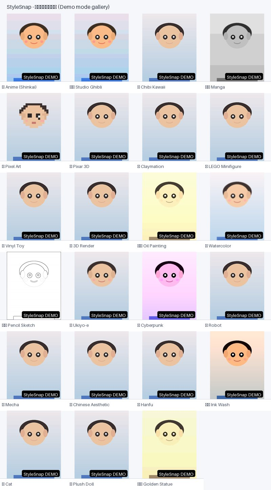

<div align="center">

# ✨ StyleSnap

**一张照片，百种风格 · One photo, every style**

照片 + 提示词 → 风格化人像的开源实现。内置 **23 种手工调校的风格提示词库**，身份保持，一键多风格出图。
The open-source way to turn *one photo + a prompt* into stylized portraits. Ships with **23 hand-tuned style prompts**, identity preservation, and one-click multi-style generation.

[](LICENSE)
[](https://www.python.org/)


</div>

---

## 🎬 这是什么 / What is this

抖音 / 小红书上爆火的「**照片变身**」玩法：上传一张自己的照片，AI 把你画成动漫、皮克斯、赛博朋克、古风、猫咪……生成「**平行世界的你**」。

爆款的秘密其实藏在**提示词**里。StyleSnap 把这件事产品化：

- 内置 **23 种**手工调校的提示词（正向 + 负向 + 参数），**免写提示词**，点一下就好；
- 基于 **InstantID**（身份保持最强）的真实生成，也可自定义提示词；
- **一键全部风格**：一张照片批量出全部风格，支持**前后对比滑块**与画廊下载；
- **中英双语界面**，浏览器语言自动切换；
- 无 API 密钥也能用 —— 内置**演示模式**跑通整个产品流程。

> The viral "photo metamorphosis" trick on Douyin/Xiaohongshu — upload your photo, let AI redraw you as anime, Pixar, cyberpunk, hanfu or a cat. The real secret is in the **prompts**. StyleSnap productizes it: 23 hand-tuned prompts, InstantID identity preservation, one-click all-styles generation, before/after comparison, bilingual UI, and a no-key **demo mode**.

## 🖼️ 效果展示 / Demo

> 演示模式(Mock)生成效果示例 · Sample output rendered in demo mode
>
> 

## ⚡ 快速开始 / Quick Start

无需任何 API 密钥，30 秒跑起来（演示模式）：

```bash
git clone https://github.com/RazorEdge-wyh/StyleSnap.git
cd StyleSnap

# Windows
start.bat
# 或 / or
python -m venv .venv
.venv\Scripts\pip install -r requirements.txt
python run.py

# macOS / Linux
python3 -m venv .venv && .venv/bin/pip install -r requirements.txt && python run.py
```

打开 <http://localhost:8000> —— 上传照片、选风格、生成。

> No API key needed — 30 seconds to a running demo mode:
> open <http://localhost:8000>, upload a photo, pick a style, generate.

### 🔑 接入真实 AI 生成 / Enable real generation

1. 注册 [Replicate](https://replicate.com) 并获取 [API Token](https://replicate.com/account/api-tokens)（免费注册，新用户有测试额度）；
2. 复制 `.env.example` 为 `.env`，填入 Token：

   ```bash
   cp .env.example .env
   # 编辑 .env：填入 REPLICATE_API_TOKEN=你的token
   ```

3. 重启服务即可切换为真实生成模式（页面右上角显示 🟢 真实生成）。

> 成本参考：InstantID 每张约 **$0.01–0.05**，"一键全部风格"约 $0.3–1.0。
> Cost: roughly **$0.01–0.05 per image** on Replicate InstantID.

## 🎨 提示词库 / Prompt Library

`styles.yaml` 是这个项目的**灵魂**。每条风格包含：`prompt`（正向提示词模板，`{subject}` 占位符）、`negative_prompt`（负向提示词）、`params`（IdentityNet / IP-Adapter 强度、步数、引导系数）。

| 分类 | 风格 |
|---|---|
| 动漫 Anime | 🌸 日漫·新海诚 `anime` · 🏔️ 吉卜力 `ghibli` · 🧸 Q版 `chibi` · 🖋️ 日系漫画 `manga` · 👾 像素 `pixel` |
| 影视/3D Film & 3D | 🎬 皮克斯3D `pixar` · 🎨 黏土 `clay` · 🧱 乐高 `lego` · 🧿 潮玩手办 `toy` · 💎 3D渲染 `3drender` |
| 艺术 Art | 🖼️ 油画 `oil` · 🌊 水彩 `watercolor` · ✏️ 素描 `sketch` · 🌊 浮世绘 `ukiyoe` |
| 科幻 Sci-fi | 🌆 赛博朋克 `cyberpunk` · 🤖 机器人 `robot` · 🦾 机甲 `mecha` |
| 古风 Chinese | 🏮 国风写真 `guofeng` · 🎐 汉服 `hanfu` · 🖌️ 水墨 `inkwash` |
| 趣味 Fun | 🐱 猫咪 `cat` · 🧵 布偶娃娃 `doll` · 🏛️ 黄金雕像 `goldstatue` |

**添加自己的风格** / Add your own style：在 `styles.yaml` 里加一条即可，例如：

```yaml
- id: mystyle
  emoji: 🎨
  category: art
  name_zh: 我的风格
  name_en: My Style
  desc_zh: 一句话描述
  desc_en: one-line description
  prompt: "A {subject} in my style, [关键词]"
  params: { identitynet: 0.8, adapter: 0.8, steps: 30, guidance: 5 }
```

## 🏗️ 架构 / Architecture

刻意保持精简 / Intentionally simple:

```
stylesnap/
├── backend/
│   ├── main.py          # FastAPI 路由 + 托管前端
│   ├── providers.py     # Replicate InstantID + MockProvider
│   └── config.py        # 环境变量 / 自动加载 .env
├── frontend/index.html  # 单页 UI（Tailwind CDN + 原生 JS + i18n）
├── styles.yaml          # ★ 提示词库（23 种风格）
├── run.py               # 启动脚本
├── Dockerfile
└── docs/demo-gallery.jpg
```

### API

| 方法 | 路径 | 说明 |
|---|---|---|
| GET | `/api/health` | 状态（demo / replicate 模式） |
| GET | `/api/styles?lang=zh\|en` | 本地化提示词库 |
| POST | `/api/transform` | 单张照片 + 风格 → 生成结果（multipart） |
| GET | `/` | 前端单页 |

### 演示模式 / Demo mode

未配置 `REPLICATE_API_TOKEN` 时自动进入演示模式：用 Pillow 滤镜模拟风格化，**不消耗任何费用**，用于跑通完整产品流程。真实生成需在 `.env` 配置 Token。

## 🚀 部署 / Deploy

```bash
docker build -t stylesnap .
docker run -p 8000:8000 --env-file .env stylesnap
```

## ⚠️ 合规提醒 / Compliance

本工具生成内容为 **AI 生成内容**。在抖音、快手、小红书等平台发布时，请按平台要求标注「含 AI 生成内容」。请勿用于生成他人肖像、名人或受版权保护的形象。

> Outputs are **AI-generated**. When posting to social platforms (Douyin, Kuaishou, Xiaohongshu, etc.), label them as AI-generated as required. Do not generate likenesses of other people or copyrighted characters.

## 📄 许可 / License

[Apache License 2.0](LICENSE) · 提示词模板灵感参考 [InstantID](https://github.com/InstantID/InstantID)（Apache-2.0）。生成能力由 [Replicate](https://replicate.com) 上的 InstantID 模型提供。

---

**如果这个项目帮到了你，欢迎 ⭐ Star。** / If this helps you, a ⭐ would be awesome.

---

© 2026 [王越豪（湖南科技大学 26 届）](https://github.com/RazorEdge-wyh)
